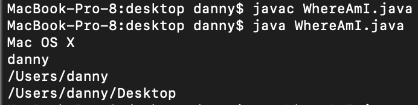
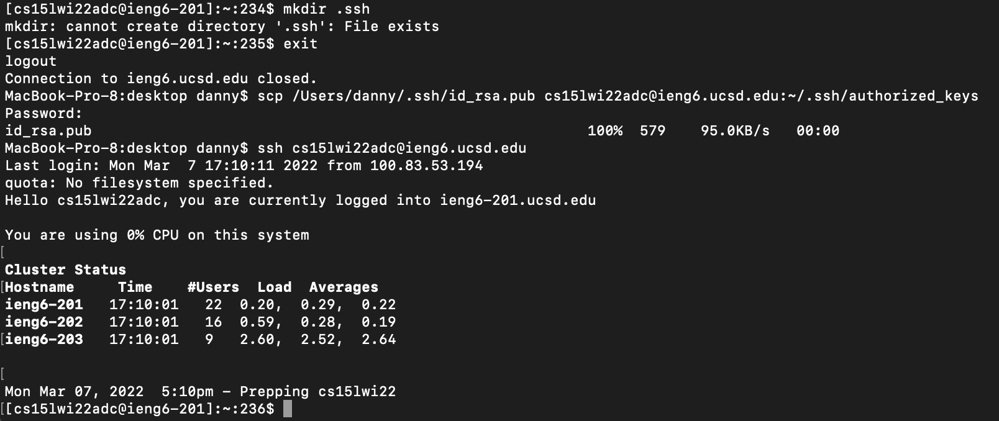

# Lab Report 1

## Installing VScode

* I already had VSCode installed from a previous code. [This link](https://code.visualstudio.com/docs/setup/mac) provides instruction for instalatino on mac.

## Remotely Connecting

* To remotely connect to my account, I used `ssh` and the name of my account as the argument. I was then prompted for my password, which is the same one that I use for TritonLink. 

## Trying Some Commands

* Here I tried some different commands inside of my ieng6 account. `cp` copied a file from a different public account. I then used `cat` to look at the contents. `ls` allowed me to look at the files and directories inside my current directory. `cd` allowed me to change to a different directory within the current directory. `cd` without an argument took me back to the home directory of my ieng6 account. 

## Moving Files with scp

* First I compiled and ran WhereAmI on my computer.

* Then, I used `scp` to copy WhereAmI.java into my ieng6 account. After logging into my account, I was able to compile and run WhereAmI.java in my ieng6 account. 

## Setting an SSH Key

* First I made a key on my local computer using `ssh-keygen` and left the password empty.  

* Then I copied the key into a directory in my ieng6 account using `scp`. 

## Optimizing Remote Running

* Here I used a single command to copy, compile, and run a file into my ieng6 account. Note that I did not have to input my password because I made the ssh key in the previous step.

