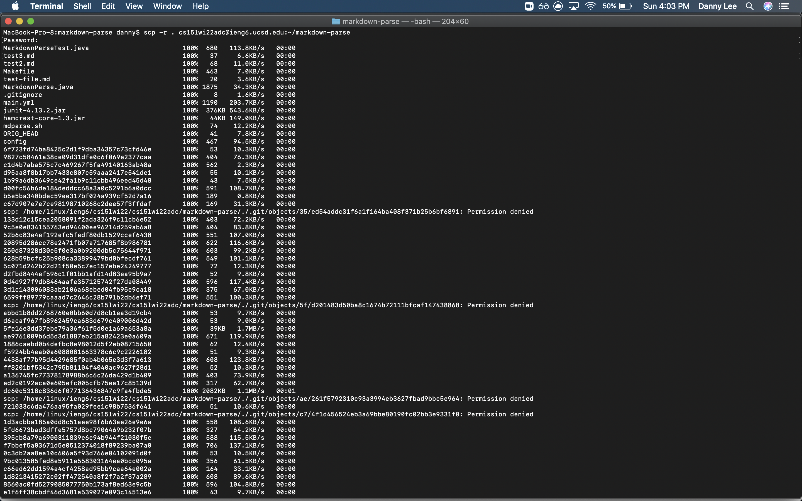
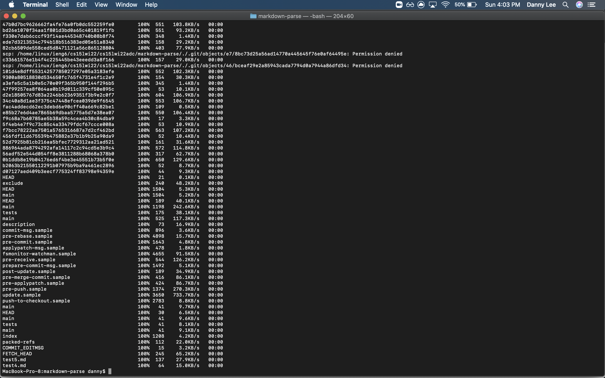
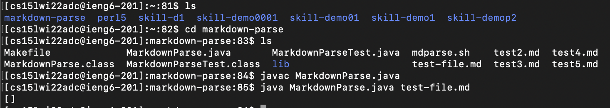
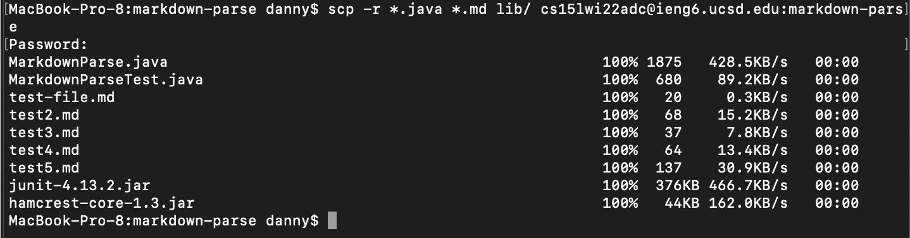
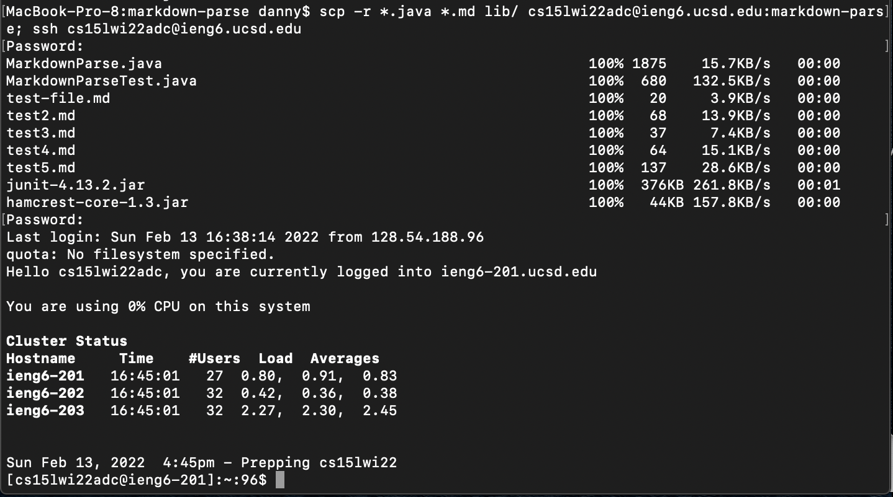

# Lab Report 3

## Copy whole directories with scp -r

 
 

* copying the whole markdown-parse file

 

* markdown-parse is now in my ieng6 account and is able to be compiled and run

 
* There was a lot of stuff that was copied into my account that was not a java or md file

 
* both copy and login to my account in a single line.