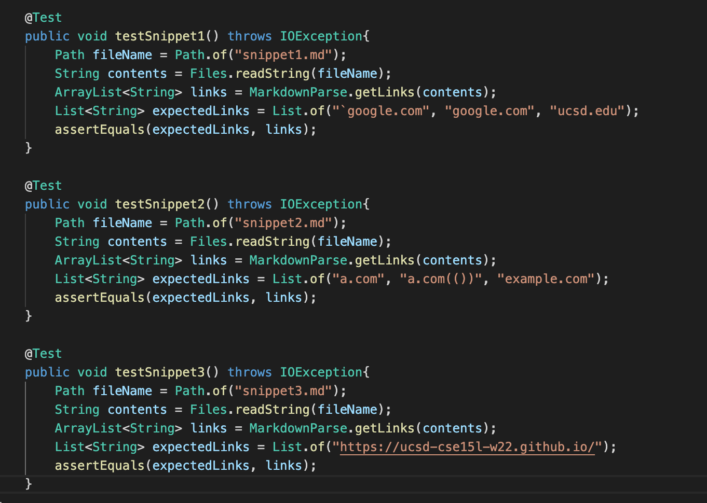
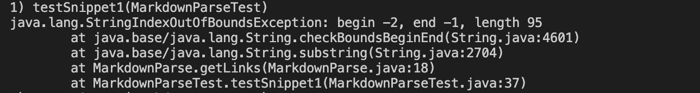
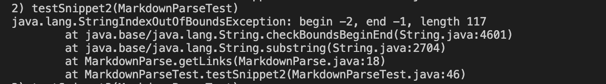
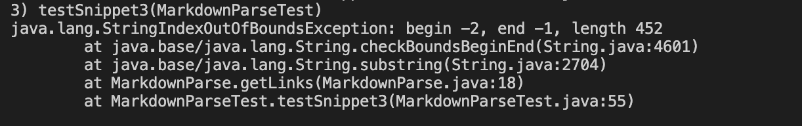
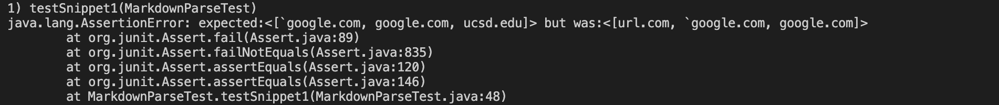
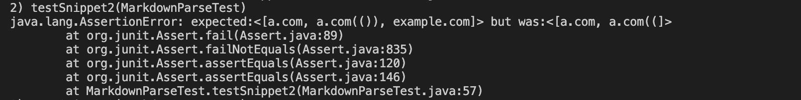
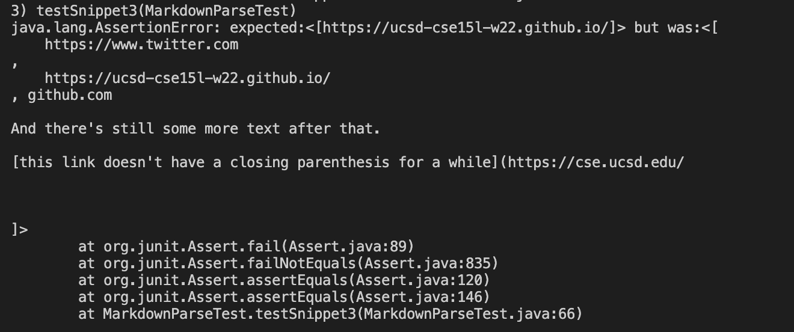

# Lab Report 4
## My repositories
[My Repository](https://github.com/dannytlee12/markdown-parse)

[Reviewed Repository](https://github.com/ajwboi/markdown-parse)

## Testing

* This is the code for the tests that I used for both my MarkdownParse and the one that I reviewed.
* For snippet1, the correct links are [`google.com, google.com, ucsd.edu]
* For snippet2, the correct links are [a.com, a.com(()), example.com]
* For snippet3, the correct links are [https://ucsd-cse15l-w22.github.io/]

## My Implementation

* This is the output that I got for snippet1. A Failure.

* This is the output that I got for snippet2. A Failure.

* This is the output that I got for snippet3. A Failure.

## Their Implementation
* This section of the report is for the group that I reviewed.

* This is the output that they got for snippet1. A Failure.

* This is the output that they got for snippet2. A Failure.

* This is the output that they got for snippet3. A Failure.

## Imporving my MarkdownParse

#### Do you think there is a small (<10 lines) code change that will make your program work for snippet 1 and all related cases that use inline code with backticks? If yes, describe the code change. If not, describe why it would be a more involved change.
* I do think that there is a small code change that could be made to fix this error. This test fails at line 18

#### Do you think there is a small (<10 lines) code change that will make your program work for snippet 2 and all related cases that nest parentheses, brackets, and escaped brackets? If yes, describe the code change. If not, describe why it would be a more involved change.

#### Do you think there is a small (<10 lines) code change that will make your program work for snippet 3 and all related cases that have newlines in brackets and parentheses? If yes, describe the code change. If not, describe why it would be a more involved change.
