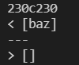
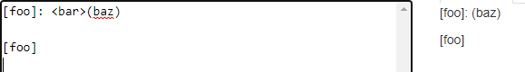
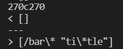
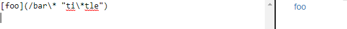

# Lab Report 5

* To start this lab, we copied test files and a script from Joe's markdown parse file using `cp`. We then ran the script for both our and Joe's markdown parse and copied the results into two different txt files using `bash script > results.txt` and `bash script > results2.txt`.
* Next, we used diff to compare the two results files to find which test files had different results. 

### Test 1

* The first test difference that we looked at was on line 270 of our results textfile. Joe's output was `[]` and ours was `[/bar\* "ti\*tle"]`

* This test was 22.md in the test-files directory that we downloaded. To find the correct output, we went on the CommonMark demo site. We found that test22.md was not supposed to produce a link, so our implementation was correct. 
* This test can likeley be fixed by checking if there are unnecessary characters between the closing bracket and the openning parenthesis.

### Test 2

* The second difference we looked at happened on line 230 of the results textfile. Joe's output was `[baz]` and ours was `[]`. 

* This test was 22.md in the test-files directory that we downloaded. Again, to find the correct output, we went to the CommonMark demo site and found that a link was produced by this test, so our implementation was correct again.

* 

